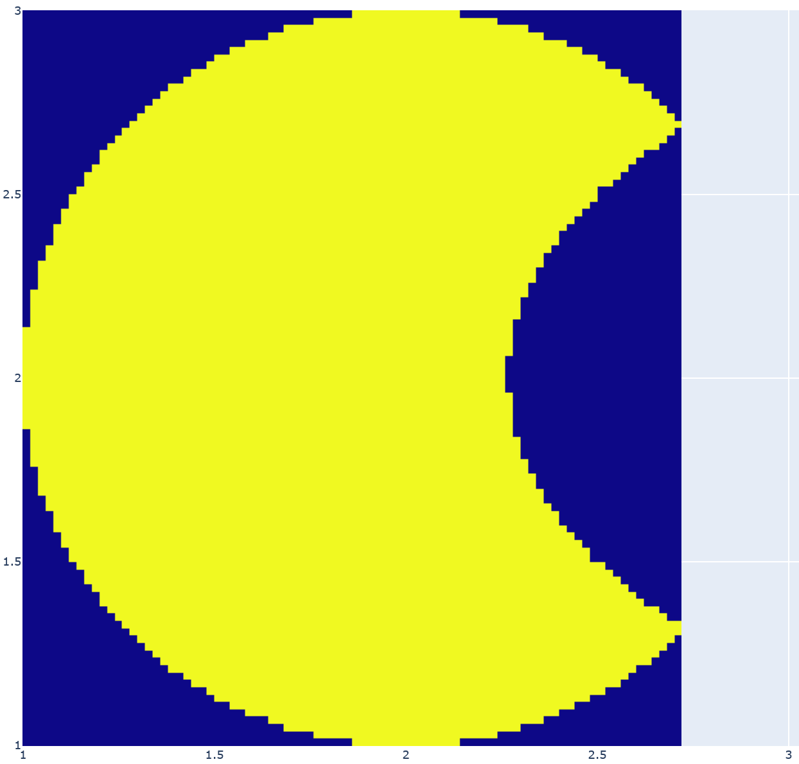
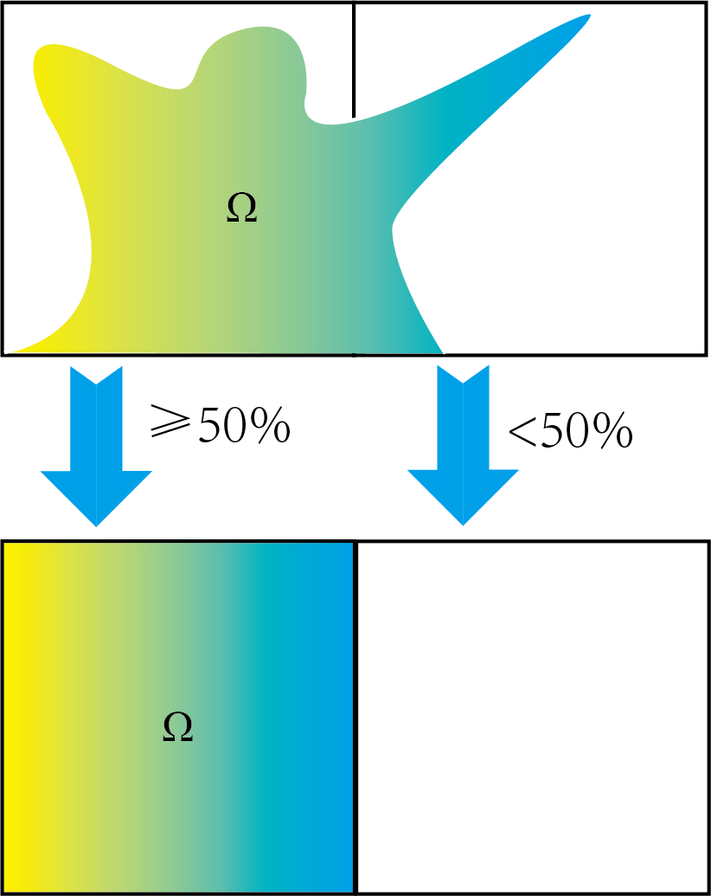

# [SIAE] 线性二阶椭圆方程的数值分析

> 2021.12  偏微分方程数值分析-大作业 

**Author: GitHub@laorange**

**LICENSE: AGPL-3.0 License**

## 第1章  问题分析

### 1.1  线性椭圆算子问题概述

对于线性二阶椭圆方程：
$$
\left\{\begin{array}{l}
a(x, y) \frac{\partial^{2} y}{\partial x^{2}}+2 b(x, y) \frac{\partial^{2} u}{\partial x \partial y}+c {(x, y)} \frac{\partial^{2} y}{\partial y^{2}}+d(x, y) \frac{\partial u}{\partial x}=f(x, y) ,\quad(x, y) \in \Omega \in R^{2} \\
u(x,y) = g(x,y),\quad (x, y) \in \partial\Omega \\
a(x,y)>0\\ b(x,y)>0\\
ac-b^2>0
\end{array}\right.
$$
试构造它的离散差分格式。

### 1.2  作业要求

+ $a、b、c、d、f、g$ 均不可以是常函数
+ $\Omega$ 最好不要是矩形
+ $a、b、c、d$ 相同将视为组队，每小组不可超过3人 
+ 小组内的$\Omega$不可相同

### 1.3  理论分析

$$
{a_{i,j}}\frac{{{u_{i + 1,j}} - 2{u_{i,j}} + {u_{i - 1,j}}}}{{{h_1}^2}} + 2{b_{i,j}}\frac{{{u_{i + 1,j + 1}} - {u_{i + 1,j - 1}} - {u_{i - 1,j + 1}} + {u_{i - 1,j - 1}}}}{{4{h_1}{h_2}}} + {c_{i,j}}\frac{{{u_{i,j + 1}} - 2{u_{i,j}} + {u_{i,j - 1}}}}{{{h_2}^2}} + {d_{i,j}}\frac{{{u_{i + 1,j}} - {u_{i - 1,j}}}}{{2{h_1}}} = {f_{i,j}}
$$

该差分格式为中心九点差分格式，二阶偏导部分的精度为$O({h^2})$ 一阶偏导的精度也为 $O({h^2})$，这是由于:
$$
u(x + h) = u(x) + u'(x)h + \frac{{u''(x)}}{2}{h^2} + o({h^2})
$$

$$
u(x - h) = u(x) - u'(x)h + \frac{{u''(x)}}{2}{h^2} + o({h^2})
$$

作差得:
$$
u'(x) = \frac{{u(x + h) - u(x - h)}}{{2h}} + o({h^2})
$$
所以得精度为$O({h^2})$ ，那么实际上该九点差分法是优于五点差分的，但是考虑整体情形与考虑局部不同，可以看到，即使泰勒展开保证该差分方法的一阶导精度在${\rm{o}}({h^2})$范围，实际上仍然在局部可能出现较大的偏差，甚至不如两点差分。

所以实际上该差分格式在步长不采取足够大的情形下处理解为单调函数的情形更优，而针对波动过大的方程则很容易导致运算的不收敛，即便差分格式满足很好的对称性。

### 1.4  参数选取

以下是问题中各函数和参数的选取：

+ x方向网格宽度 h1: 0.02
+ y方向网格高度 h2: 0.02
+ $a(x,y) = {e^x}$
+ $b(x,y) = {\sin ^2}(x + y)$
+ $c(x,y) = {e^y}$
+ $d(x,y) = \frac{1}{{1 + {e^{ - xy}}}}$
+ $f(x,y) = {e^{x + y}}$
+ $g(x,y) = {x^2} + {y^2}$
+ $\Omega  = \left\{ {(x,y) \in {\mathbb{R}^2}|{{\left( {x - 2} \right)}^2} + {{\left( {y - 2} \right)}^2} \le 1} \right\}\; \cup \;\left\{ {(x,y) \in {\mathbb{R}^2}|\;{{\left( {x - 2} \right)}^2} + \frac{{{{\left( {y - 4} \right)}^2}}}{3} > 1} \right\}$

经检验，在选定的Ω区域内满足相容性条件。

## 第2章  算法设计

### 2.1  算法概述

首先，本文在x、y方向的网格长度均为0.02。

随后将Ω区域锯齿化，锯齿化后的Ω区域如下图所示：

锯齿化后的Ω区域在网格上的点是有限的，因此，可将这些格点的总数量记为*n*。对所有格点逐个检验：

+ 若周围8点均在Ω区域内，则该点记为内点，内点的集合记为$P_{in}$;
+ 若周围8点均不在Ω区域内，则该点记为无关点；
+ 其余点记为边界点，边界点的集合记为$P_{bc}$。

剔除无关点，内点和边界点构成的集合记为$P = {P_{in}} \cup {P_{bc}} = \{ {p_1},{p_2},...,{p_n}\} $

对$P$中所有元素进行编号，编号的集合记为$N = \{ 1,2,3,...,n\} $。$P$与$N$构成双射。若$p\in P$，且假设$p$的编号为$i$，则将$p$记为$p_i$。

考虑一个内点${p_i} \in {P_{in}}$，向右为x轴正方向，向上为y轴正方向，如下表所示：

| ${p_{{i_{ - 1,1}}}}$    | ${p_{{i_{0,1}}}}$ | ${p_{{i_{1,1}}}}$    |
| ----------------------- | ----------------- | -------------------- |
| ${p_{{i_{ - 1,0}}}}$    | $p_i$ (参考点)    | ${p_{{i_{1,0}}}}$    |
| ${p_{{i_{ - 1, - 1}}}}$ | ${p_{{i_{0,1}}}}$ | ${p_{{i_{1, - 1}}}}$ |

则有差分格式：
$$
{f_i} = \left[ {\begin{array}{*{20}{c}}
{{u_{{p_{{i_{ - 1, - 1}}}}}}}&{{u_{{p_{{i_{ - 1,0}}}}}}}&{{u_{{p_{{i_{ - 1,1}}}}}}}&{{u_{{p_{{i_{0, - 1}}}}}}}&{{u_{{p_i}}}}&{{u_{{p_{{i_{0,1}}}}}}}&{{u_{{p_{{i_{1, - 1}}}}}}}&{{u_{{p_{{i_{1,0}}}}}}}&{{u_{{p_{{i_{1,1}}}}}}}
\end{array}}\right]\left[ {\begin{array}{*{20}{c}}
{{{\rm{s}}_{{p_{{i_{ - 1, - 1}}}}}}}\\
{{{\rm{s}}_{{p_{{i_{ - 1,0}}}}}}}\\
{{{\rm{s}}_{{p_{{i_{ - 1,1}}}}}}}\\
{{{\rm{s}}_{{p_{{i_{0, - 1}}}}}}}\\
{{{\rm{s}}_{{p_i}}}}\\
{{{\rm{s}}_{{p_{{i_{0,1}}}}}}}\\
{{{\rm{s}}_{{p_{{i_{1, - 1}}}}}}}\\
{{{\rm{s}}_{{p_{{i_{1,0}}}}}}}\\
{{{\rm{s}}_{{p_{{i_{1,1}}}}}}}
\end{array}} \right]\;
$$

$$
\quad \left\{ \begin{array}{l}
{{\rm{s}}_{{p_{{i_{ - 1, - 1}}}}}} = \frac{{2{b_{{p_i}}}}}{{{h_1}{h_2}}}\\
{{\rm{s}}_{{p_{{i_{ - 1,0}}}}}} = \frac{{{a_{{p_i}}}}}{{h_1^2}} - \frac{{{d_{{p_i}}}}}{{{h_1}}}\\
{{\rm{s}}_{{p_{{i_{ - 1,1}}}}}} = \frac{{2{b_{{p_i}}}}}{{{h_1}{h_2}}}\\
{{\rm{s}}_{{p_{{i_{0, - 1}}}}}} = \frac{{{c_{{p_i}}}}}{{h_2^2}}\\
{{\rm{s}}_{{p_i}}} = {\rm{ - }}\left( {\frac{{2{a_{{p_i}}}}}{{h_1^2}} + \frac{{2{c_{{p_i}}}}}{{h_2^2}}} \right)\\
{{\rm{s}}_{{p_{{i_{0,1}}}}}} = \frac{{{c_{{p_i}}}}}{{h_2^2}}\\
{{\rm{s}}_{{p_{{i_{1, - 1}}}}}} =  - \frac{{2{b_{{p_i}}}}}{{{h_1}{h_2}}}\\
{{\rm{s}}_{{p_{{i_{1,0}}}}}} = \frac{{{a_{{p_i}}}}}{{h_1^2}} + \frac{{{d_{{p_i}}}}}{{{h_1}}}\\
{{\rm{s}}_{{p_{{i_{1,1}}}}}} = \frac{{2{b_{{p_i}}}}}{{{h_1}{h_2}}}
\end{array} \right.
$$

其中$a, b, c, d, f, g, u$以$p$为右下角标，表示对应函数在$p$点的取值。

根据差分格式，可写出该式：$R \cdot U = V$。

其中$R = \left[ {\begin{array}{*{20}{c}}
{{r_{11}}}&{{r_{12}}}&{{r_{13}}}&{...}&{{r_{1n}}}\\
{{r_{21}}}&{{r_{22}}}&{{r_{23}}}&{...}&{{r_{2n}}}\\
{{r_{31}}}&{{r_{32}}}&{{r_{33}}}&{...}&{...}\\
{...}&{...}&{...}&{...}&{...}\\
{{r_{n1}}}&{{r_{n2}}}&{...}&{...}&{{r_{nn}}}
\end{array}} \right]$

$U = \left[ {\begin{array}{*{20}{c}}
{{u_{{p_1}}}}\\
{{u_{{p_2}}}}\\
{{u_{{p_3}}}}\\
{...}\\
{{u_{{p_n}}}}
\end{array}} \right]$，$V = \left[ {\begin{array}{*{20}{c}}
{{v_{{p_1}}}}\\
{{v_{{p_2}}}}\\
{{v_{{p_3}}}}\\
{...}\\
{{v_{{p_n}}}}
\end{array}} \right]$，${v_{{p_i}}} = \left\{ {\begin{array}{*{20}{c}}
{{u_{{p_i}}}\quad {p_i} \in {P_{in}}}\\
{{g_{{p_i}}}\quad {p_i} \in {P_{bc}}}
\end{array}} \right.$，

${r_{ij}} = \left\{ \begin{array}{l}
{s_{{p_j}}},\quad {p_j} \in \{ {p_{{i_{ - 1,1}}}},{p_{{i_{0,1}}}},{p_{{i_{1,1}}}},{p_{{i_{ - 1,0}}}},{p_i},{p_{{i_{1,0}}}},{p_{{i_{ - 1, - 1}}}},{p_{{i_{0,1}}}},{p_{{i_{1, - 1}}}}\} \\
0,\quad otherwise
\end{array} \right.$。

又有：$U = {R^{ - 1}} \cdot V$，因此通过构造*R*、*V*，并求出*R*的逆矩阵来求解*U*，即可求出$u(x,y)$在Ω区域上所有格点上的取值。

### 2.2  利用Monte Carlo方法对Ω区域锯齿化

蒙特·卡罗方法（Monte Carlo method），也称统计模拟方法，是二十世纪四十年代中期由于科学技术的发展和电子计算机的发明，而被提出的一种以概率统计理论为指导的一类非常重要的数值计算方法。是指使用随机数（或更常见的伪随机数）来解决很多计算问题的方法。

在对Ω区域进行网格划分时，会根据网格与Ω区域的交集区域的占比进行锯齿化，若占比大于等于50%则将该网格视为在Ω区域中，若占比小于50%则将该网格视为不在Ω区域中，如下图所示。

在判断面积占比是否大于等于50%时即使用了Monte Carlo方法。在实际计算时，是向每个需要估算的网格随机抛投10000个点，若有大于等于5000个随机点落在Ω区域中，则将该网格视为在Ω区域中，反之则视为不在Ω区域中。

## 第3章  程序实现

程序采用python语言编写而成，采用了面向对象编程的设计方式(OOP, Object Oriented Programming)，共设计了六个类型，分别为`Handler`(操作器类)、`Table`(表格类)、`Point`(点类)、`PointWithBoundaryCondition`(边界点类)、`Util`(工具包类)、`Config`(设置类)，其中边界点类继承自点类。

在主函数中，首先实例化操作器类为一个操作器，在操作器初始化时会通过调取设置类中的信息，在使用Monte Carlo方法将Ω区域锯齿化后生成一个包含点、边界点的表格类实例并将其赋为操作器的属性；随后使用表格的成员方法solve来求解出结果，最后使用了点类的静态方法`plot_finally`将结果可视化。

## 第4章  结果

如下图所示：

